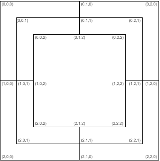

# Kétjátékos malom játék

## Rövid leírás
Ez a malom program az ELTE Informatikai Kar Programtervező Informatikus szakán az "Eseményvezérelt alkalmazások" tárgy során elkészített nagybeadandó feladata. 

## Használat
A repository cloneozása után meg kell nyitni a NineMansMorrisWPF.sln fáljt Visual Studioval és F5-tel egyből indítható a program, majd a malom szabályai alapján (kivéve ugrás), addig megy a játék, amíg az egyik játékosnak csak két köve van a táblán. 

## Megvalósítás
A programot MVVM architektúrában valósítottam meg, az egyes rétegek fájljai külön vannak csoportosítva a fájlrendszerben. 
### Model 
A legérdekesebb probléma a malom tábla reprezentálásának problémája volt. A malom tábla gyűrűkből áll melyeket egy-egy 3x3-as "középen lyukas" mártixszal reprezentáltam. A mezők egyértemű azonosításához egy olyan 3 dimenziós koordinátarendszert vezettem be, ahol az első két koordináta a mező adott gyűrűn elfoglalt vízszintes és függőleges pozícióját adja meg, a harmadik pedig a gyűrű számát adja meg. 

A játékmenetet 5 különböző állapottal építettem fel. Egy állapot mindig a soron következő játékosra érvényes. Az állapotok az alábbiak:
- PLACE (kő lehelyezezése)
- PICKUP (ellenfél nem malomban lévő kövének felvétele)
- MOVE_BEGIN (a mozgatni kívánt kő kiválasztása)
- MOVE_END (a mozgatás célmezejének kiválasztása)
- GAME_OVER (egy játékosnak csak két köve maradt, vége a játéknak)

Egy éppen aktív játék bármikor elmenthető és a megfelelő szöveges mentésfájlok bármikor betölthetők. Erre egy példa a NineMansMorrisModel/Persistence/SavedGames/game1.nmm elérési úton található szöveges fájl. A további mentések szintén ezen az elérési úton tárolódnak.  A mentési fájl felépítése soronként:
1.	játékfázis (string)
2.	aktuális játékos (string)
3.	fehér játékos letett bábuinak száma (int)
4.	fehér játékos táblán lévő bábuinak száma (int)
5.	fekete játékos letett bábuinak száma (int)
6.	fekete játékos táblán lévő bábuinak száma (int)
7.	aktuálisan kiválasztott mező koordinátái ((int,int,int) ha nincs ilyen akkor NOSELECT)
   
A 8. sortól kezdve a fájl végéig a mezők adatai szerepelnek a következő formában:  
<I koordináta (int)>  <J koordináta (int)> <R koordináta (int)> <mező színe (string)> <malomtagság (bool)> <interaktálhatóság (bool)>

### Tesztelés
A program üzleti logikájának tesztelését egységtesztekkel végeztem. A tesztek megtalálhatóak a NineMansMorrisTest mappában.
